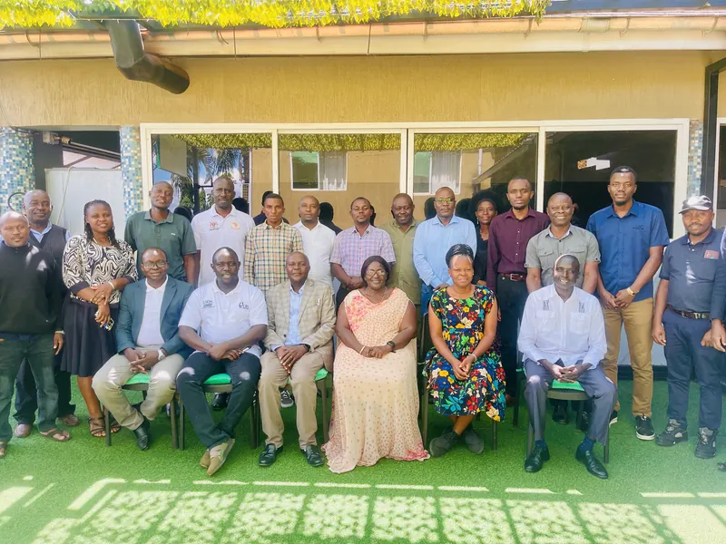

# johnsonmugarra.com

Portfolio of Johnson Mugarra — data scientist and ML engineer in Kampala, working on forecasting, impact evaluation, and data pipelines across East Africa.



## What's here

A single-page static site. No build step, no framework — HTML, Tailwind (CDN), vanilla JS, and two D3 charts (a fraud-detection scatter on synthetic data and a simulated vanilla harvest model). Contact form falls back through EmailJS → Formspree → mailto. Ships as a PWA with a service worker.

## Run it locally

Any static server works:

```
python3 -m http.server 8000
```

Or with Docker (nginx with gzip, cache headers, and a 404 page):

```
docker build -t portfolio .
docker run -p 8080:80 portfolio
```

## Checks

CI runs on every push (`.github/workflows/ci.yml`): internal anchors, local file references, JS syntax, and a non-blocking external link check. Run the same checks locally:

```
node scripts/check-refs.mjs
```

## Layout

```
index.html      the site, including both D3 charts
script.js       theme, nav, form, analytics events
sw.js           service worker (cache-first assets, network-first HTML)
nginx.conf      production server config
PRODUCT.md      brand and design principles
IMPROVEMENTS.md longer-term direction
```

Content © Johnson Mugarra. Get in touch via [johnsonmugarra.com](https://johnsonmugarra.com/#contact).
